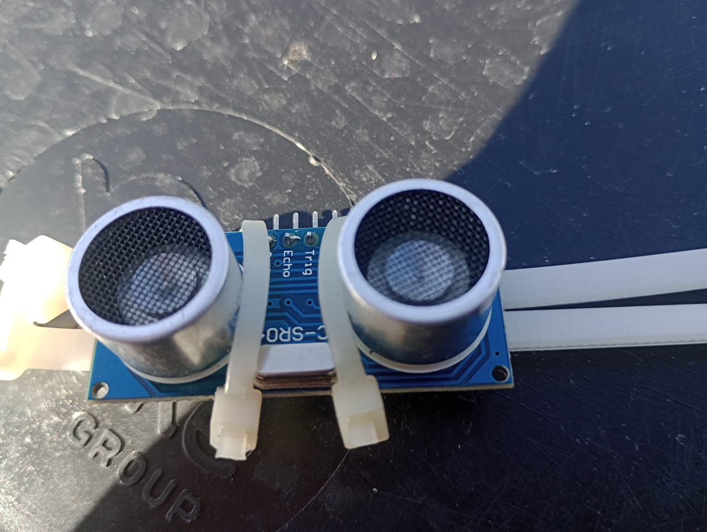
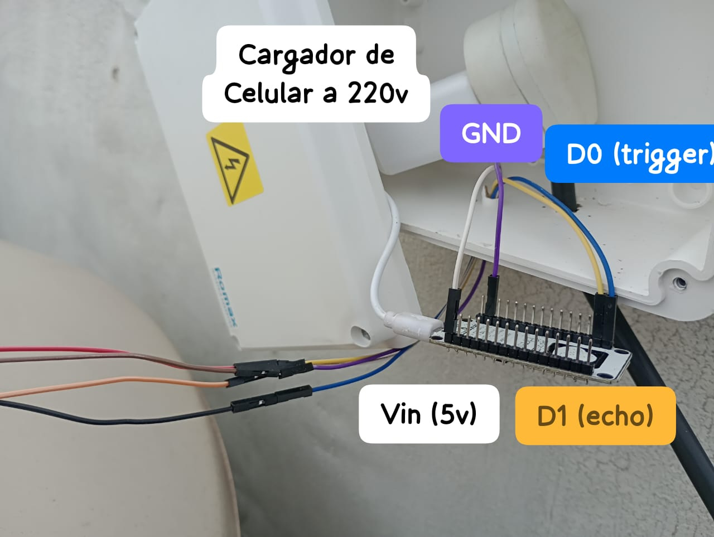
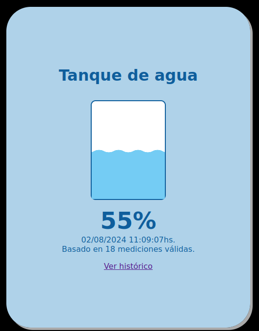
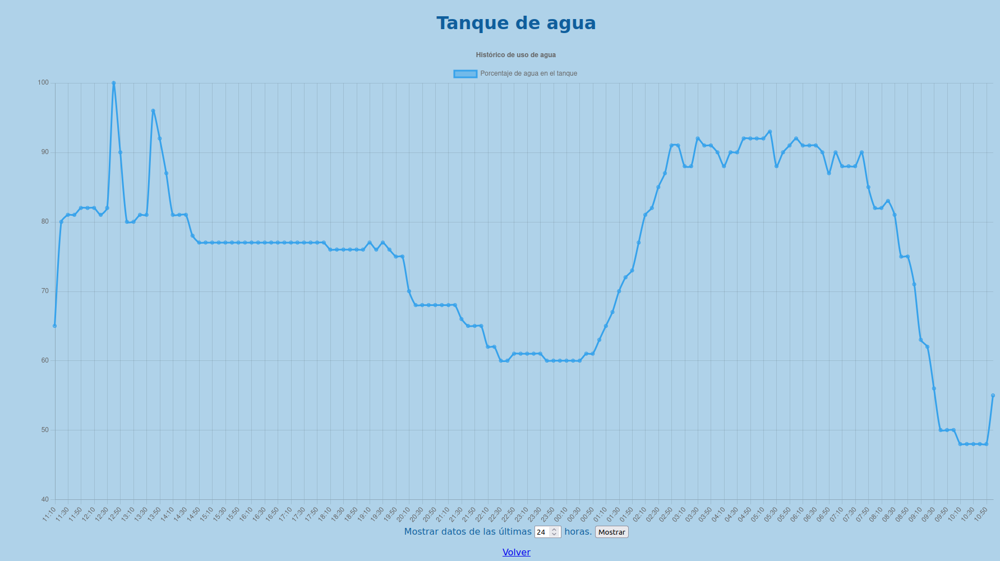

# Medición de tanque de agua

Este proyecto muestra cómo obtuvimos una medición automatizada de la cantidad de
agua que hay en el tanque de nuestra casa.

---

## Sensor
Este sensor (HCSR04) funciona de la siguiente manera: uno de los dos "ojos" (**trigger**)
lanza una **onda ultrasónica** (que es inaudible para el ser humano) que rebota contra
el objetivo más cercano y vuelve hacia el otro "ojo" (**echo**) que mide la distancia entre el
objetivo y el sensor. 

Este tiene 4 pines:
- Vcc(5V)
- GND(tierra)
- trigger
- echo

NOTAS:_el sensor tiene un margen de error de 3 cm. Además la distancia mínima entre 
el sensor y el objetivo es de 3 cm también._



---

## Placa ESP-8266
Esta placa tiene conexión WIFI y se conecta a la raspberry Pi. Por este canal
la placa manda la información hasta la raspberrypi. En la siguiente imagen se 
muestra como conectamos la placa al sensor. Cada color de las letras representa el
color del cable.


---

### Código

Ver el archivo `esp8266/tanque_esp.ino`.

Se debe modificar las siguientes líneas:

```c
const char* ssid = "ID-DE-LA-RED";
const char* password = "CLAVE-DE-LA-RED";
```

Tomamos este código de un video en youtube, que no pudimos volver a encontrar.
Sobre esta base, realizamos algunas modificaciones.

Conviene que la placa ESP-8266 tenga ip estática dentro de la red, para que
los scripts que siguen a continuación la "encuentren" en la red local.


---

## Raspberry Pi: Código python

En una raspberry pi que tenemos prendida 24hs, tenemos el código incluido en
`cliente/cliente.py`. 

Para esto, debemos instalar la dependencia `websocket-client`, con el comando:

```
pip install websocket-client
```

En ese archivo, debemos modificar las siguientes líneas

```python
    # Archivo que contendrá las mediciones del sensor:
    archivo_mediciones = "$HOME/tanque_esp/cliente/mediciones.csv"

    # Distancia desde el sensor hasta la superficie del agua cuando el tanque
    # está lleno y cuando está vacío.
    tanque_lleno = 20
    total_tanque = 100
    # Cambiar por la IP y el puerto que corresponda a la placa ESP.
    url_websocket = "ws://192.168.17.100:81"

    # Sobre el final del archivo:

    # Cantidad de mediciones que toma el sensor en cada ejecución:
    cantidad_mediciones = 10 # Podemos cambiar este valor por el que juzguemos conveniente.
```

---

## Sitio Web

Los archivos `historico.php`, `index.html`, `mostrar_historico.php`, `style.css`, `Tanque.php` y `ultima_medicion.php`. Debemos realizar los siguientes cambios:

En los archivos `mostrar_historico.php` y `ultima_medicion.php`:

```php
$archivo_mediciones = 'cliente/mediciones.csv';
```

Este sitio debe estar en un servidor web (Apache, nginx, phpcli), etc.
Otra posibilidad es hacer `git push` del archivo de mediciones cada cierto
tiempo, hacia un repositorio en la web que contenga este sitio. De este modo,
podremos consultar las mediciones a través de internet.

---

## Rotar logs

En el archivo `rotar_logs/rotar_logs.sh`, hay un script para que el archivo de
mediciones tenga siempre los datos de ayer y de hoy. Los datos de días
anteriores se copian a archivos aparte, que llevan en su nombre la fecha a la
que corresponden.

De esta manera evitamos que, luego de muchos días de ejecución el archivo de
mediciones se vuelva demasiado grande, lo que dificulta su manipulación.

En este archivo cambiaremos la carpeta donde está el proyecto, en la línea que
dice:

```bash
raiz_del_proyecto=$HOME/tanque_esp
```

---

## Cron

Luego, programaremos este script para que corra con `cron` cada noche a las
23:59hs. Para ello, escribimos el comando `crontab -e`, y allí agregamos:

```
59 23 * * * /ruta/hacia/el/archivo/rotar_logs/rotar_logs.sh
*/3 * * * * python3 /ruta/hacia/el/archivo/cliente/cliente.py
```

La primera de las líneas rota los logs, la segunda toma las mediciones del
sensor permanentemente, cada 3 minutos. En ambos casos, se debe editar la parte
que dice `/ruta/hacia/el/archivo`, reemplazandola por una ruta existente.

---

## Capturas de pantalla
Así es como se ve la página finalizada:




## Posibles inconvenientes:

- **cableado:** la placa ESP necesita ser enchufada con  un cargador de celular.
Entonces hay que hacer llegar un cable hasta la placa que lleve 220V. Si el
tanque está al aire libre tendrá que ser un cable de exteriores. Además se
necesita una caja estanca para poner dentro los tomacorriente y la placa ESP. Es
recomendable que los cables que conectan la placa con el sensor ultrasónico esten
dentro de un caño corrugado o algo similar para que no se arruinen con la lluvia.
- **condensación:** cuando el agua de el tanque se evapora, sube hasta la tapa
en forma de vapor, donde se condensa y se vuelve agua de nuevo. El problema es que
este fenómeno puede mojar el sensor, que con el tiempo, se arruina. Es posible
que tengas que cambiar el sensor una vez por año, pero no es mucho gasto económico.

